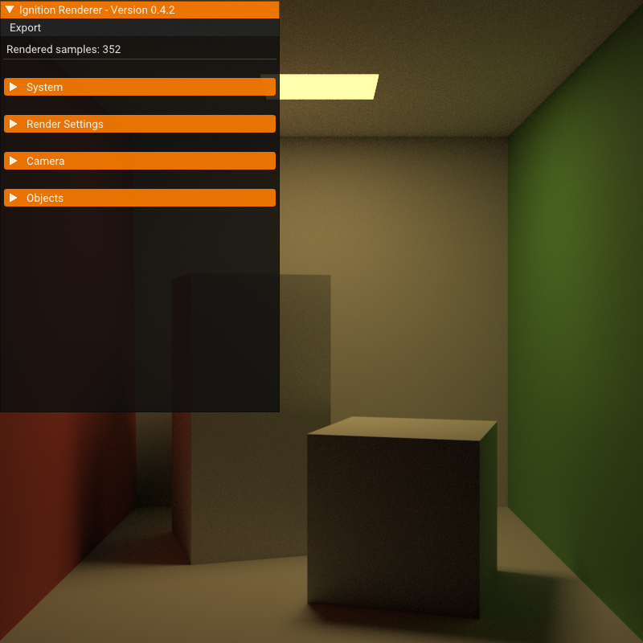
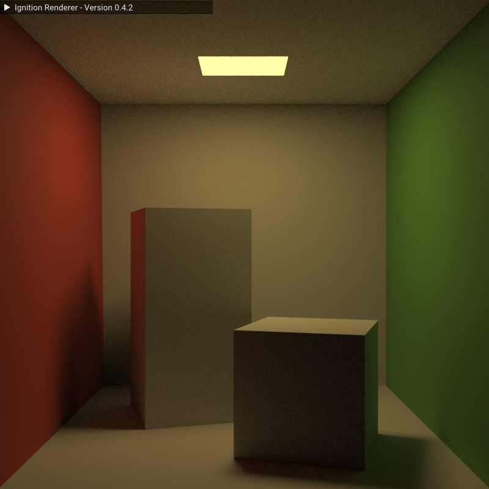
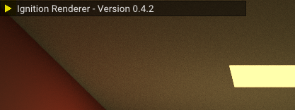
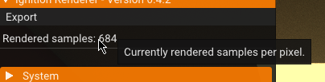
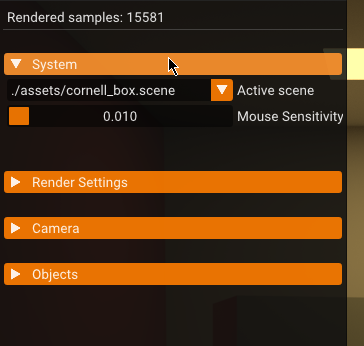
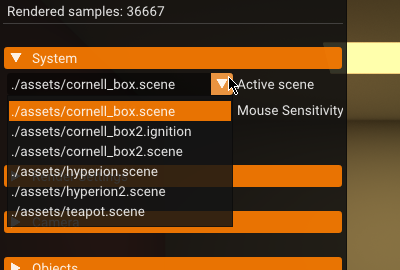
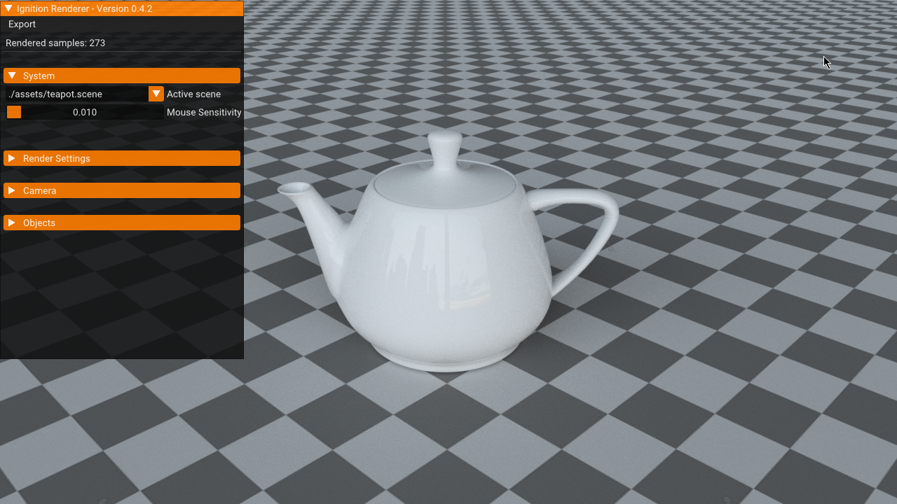
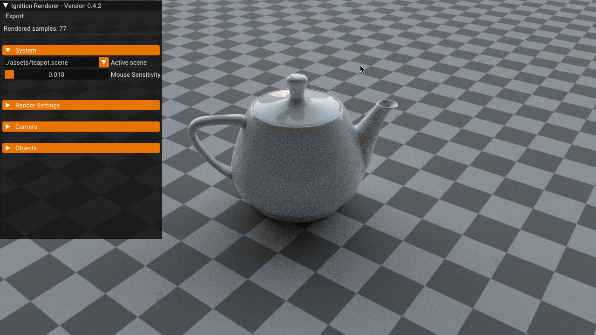
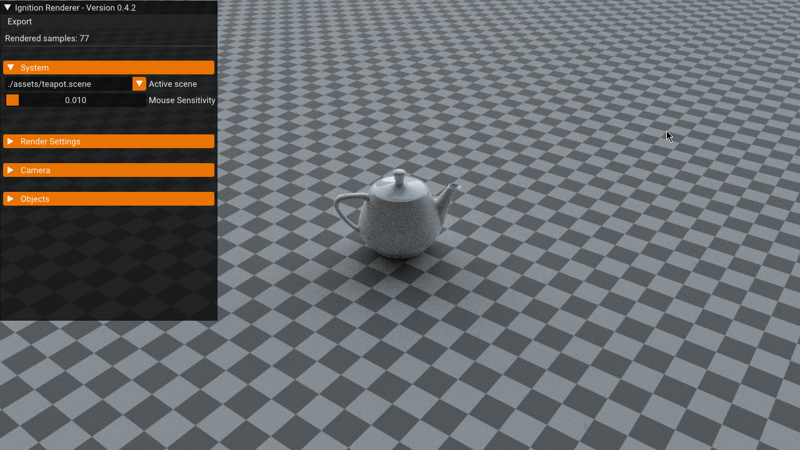
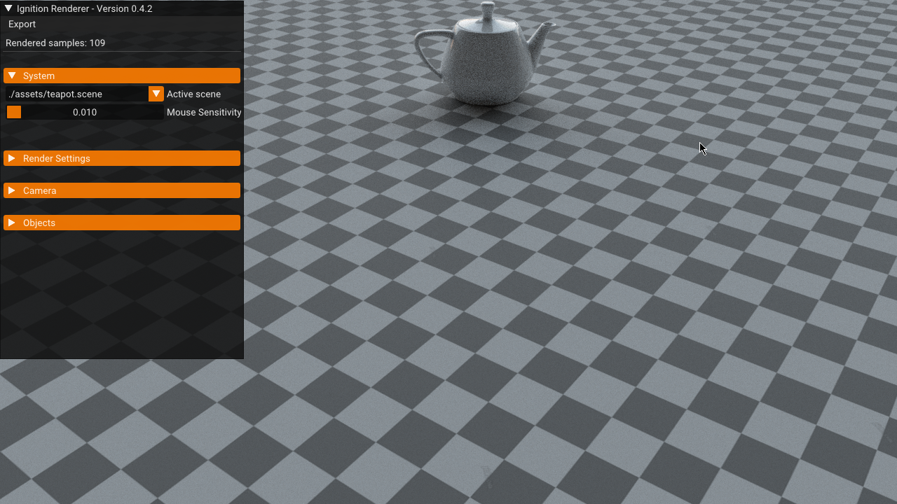

# LavaFrame documentation

For downloads and more general information about the renderer visit [ignitionrenderer.com](https://ignitionrenderer.com).

## Overview

* Installation
* Getting started
* Scene files
* FAQ

---

## Installation

You can download the latest version of the renderer as a zip file from [the downloads page.](https://lavaframe.com/download/)

After extracting the zip file you must choose between the NVIDIA/Universal version of the Renderer or the AMD version. 
If you are on an Intel or NVIDIA based GPU you should use the NVIDIA version, if you are on an AMD based platform however you must use the AMD version. 
They are currently not cross-compatible.

After extraction and version selection you simply have to run the ignition.exe application. Something similar to following screen should appear :



In case this is **not** the case and your screen looks like this :


 
You need to press the small arrow to un-collapse the menu. You can re-press this button to collapse it again (marked in yellow).



---

## Getting started

First up, examine the current panel.
You can hover over most texts and properties to get a quick description of them : 



You can open up panels to change settings by clicking on their header : 



Doing so will expose all properties of that panel.

Lets now switch the active scene to another one :



This is the example scene *Teapot*.



Now lets rotate around the scene to take a look at the other side. Hold *left mouse button and drag** to rotate around the scene.



You can zoom in and out by **holding right mouse button and dragging**.



You can move the camera by **dragging with the middle mouse button held down.**



These are the fundamental editor controls. Every other property and panel in the editor is explained with tooltips.

---

##Scene files

Scene files are the way Ignition stores, loads and handles 3D scenes, including geometry, materials, lighting and render settings. 
They are created and maintained independent of DDC allowing interoperabillity and independently.

Their syntax looks like this :
```json
Type
{
attribute value
}
#comment
``` 

Examine the following example :

```json
# An arbitrary example scene
Renderer
{
	resolution 1280 720
	maxDepth 3
	tileWidth 128
	tileHeight 128
	envMap HDR/somehdr.hdr
	hdrMultiplier 1.0
}
Camera
{
	position 20 12 0
	lookAt -0.953633 2.17253 -0.0972613
	fov 50
}

material someMaterial
{
	albedoTexture some_example_folder/someTexture.png
	roughness 0.25
}

material white
{
	color 1.0 1.0 1.0
	roughness 0.02
	clearcoat 1.0
}

mesh
{
	file some_example_folder/Mesh1.obj
	material someMaterial
}

mesh
{
	file some_example_folder/Mesh2.obj
	material white
}
```

**The following is a complete list of all types and attributes :**

```json
# Comment
Renderer
{
	resolution [int - x in pixels] [int - y in pixels]
	maxDepth [int]
	tileWidth [int]
	tileHeight [int]
	hdriMap [hdr file]
	envMap [hdr file] #Legacy - try to use hdriMap instead.
	hdrMultiplier [float] #Legacy - try to use hdriMultiplier instead.
	hdriMultiplier [float]
}

Camera
{
	position [x - float] [y - float] [z - float]
	lookAt [x - float] [y - float] [z - float]
	fov [int]
	focalDistance [float]
	aperture [float]
}

material [name - string]
{
	name [string]
	color [R - int] [G - int] [B - int] #Legacy - try to use albedo instead.
	albedo [R - int] [G - int] [B - int]
	emission [R - int] [G - int] [B - int]
	metallic [float]
	roughness [float]
	subsurface [float]
	specular [float]
	specularTint [float]
	anisotropic [float] 
	sheen [float]
	sheenTint [float]
	clearcoat [float]
	clearcoatRougness [float]
	transmission [float]
	ior [float]
	extinction [R - int] [G - int] [B - int]
	albedoTexture [texture file]
	metallicRoughness [texture file]
	normalTexture [texture file]
	
}

mesh
{
	file [mesh file]
	material [material name]
	position [x - float] [y - float] [z - float]
	scale [x - float] [y - float] [z - float]
}

light
{
	type [Sphere / Quad]
	position [x - float] [y - float] [z - float]
	emission [R - int] [G - int] [B - int]
	
	#If type = Sphere :
	radius [float]
	
	#If type = Quad : 
	v1 [vertex position x - float] [vertex position y - float] [vertex position z - float]
	v2 [vertex position x - float] [vertex position y - float] [vertex position z - float]
}
```

---

##FAQ

**Is there a way to edit scene files visually ?**
Not officially in a standalone matter, but there are 1st and 3rd party integrations in the works and already available.

**Are changed made in the renderer saved ?**
No, they are only temporary but can easily be transcribed into the scene file as all properties are named accordingly.

**Why is there a lag spike on denoise ?**
This is due to the OpenImageDenoise tool running on your CPU to denoise the image. This can cause "lag spikes" - if these happen too frequently try increase the "denoise on sample" value.

*This list will be extended over time. Feel free to ask question on our Discord (see bottom right icon).*
